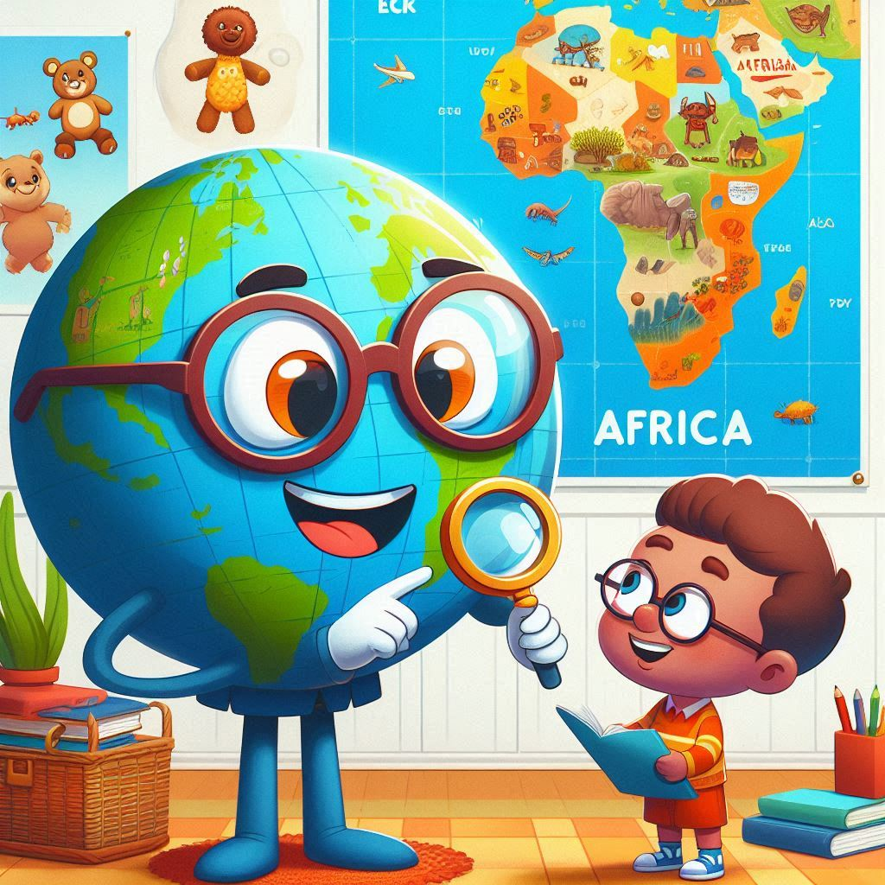

# Africa Flashcard Quizzer
This repository is a project for Code in Place 2024 program. 

The user is asked a series of random questions about the African continent, the second largest continent in the world and they are required to answer correctly thrice consecutively to pass the test. 

!The quizer may be updated occasionally